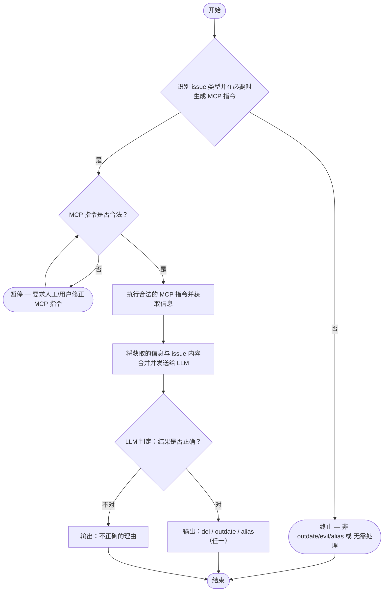

# issue-auth-tool

工作流程

# Issue 处理流程简介

1. **识别类型与生成 MCP 指令**

   * 由 LLM 识别该 Issue / Discussion 的类型：

     * `outdate`
     * `evil`
     * `alias`
     * `invalid`（无效或不相关内容）
   * 若识别为前三种类型（`outdate` / `evil` / `alias`）：

     * 要求 LLM 同时生成其**所需的 MCP 指令**（用于查询上下文或补充信息）。
   * 若识别为 `invalid`：

     * 流程终止，无需生成指令。

2. **验证 MCP 指令合法性**

   * 检查 LLM 输出的指令是否符合以下规则：

     * 仅允许使用：

       * `view <ID> [<ID> ...]`
       * `google <大学名称1> <大学名称2>`
     * 禁止执行型指令（如 `del` / `outdate` / `alias`）。
   * 若指令格式或内容不合法：

     * 暂停流程，要求用户**人工修正**。

3. **执行指令与信息获取**

   * 对合法的 MCP 指令进行执行。
   * 获取相关上下文、搜索结果或附加数据。

4. **结果合并与再判断**

   * 将获取到的上下文信息与原始 Issue / Discussion 内容合并。
   * 将合并后的信息再次发送给 LLM，让其进行结果判定：

     * **若判定正确** → 输出最终决策（`del` / `outdate` / `alias`）。
     * **若判定不正确** → 输出错误原因，并记录在结果中。

5. **输出与结束**

   * 流程最终输出：

     * 一项确定的操作类型（`del` / `outdate` / `alias`）。
     * 或不正确原因说明（当判定失败时）。
   * 之后流程结束。

流程图

