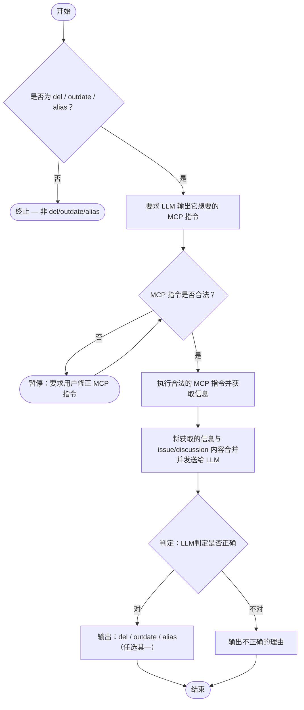

# issue-auth-tool

工作流程

1. **判断类型**

    - 检查该 Issue / Discussion 是否属于以下三类之一：

      - `del`
      - `outdate`
      - `alias`

    - 若属于其中之一，请让 LLM 输出它**打算执行的 MCP 指令**，以便后续验证。

2. **验证 MCP 指令合法性**

    - 检查 LLM 输出的命令是否符合预期格式与安全规则。

3. **执行命令**

    - 若命令合法：执行对应的 MCP 指令，获取所需信息。
    - 若命令不合法：暂停执行，并提示用户**手动修改命令**。

4. **结果验证**

    - 将获取到的信息与原始 Issue / Discussion 内容一并发送给 LLM。
    - 让 LLM 判断其推断是否正确：

           - 若判断正确 → 输出 `del` / `outdate` / `alias` 中的一项。
           - 若判断错误 → 提供错误原因。

流程图

